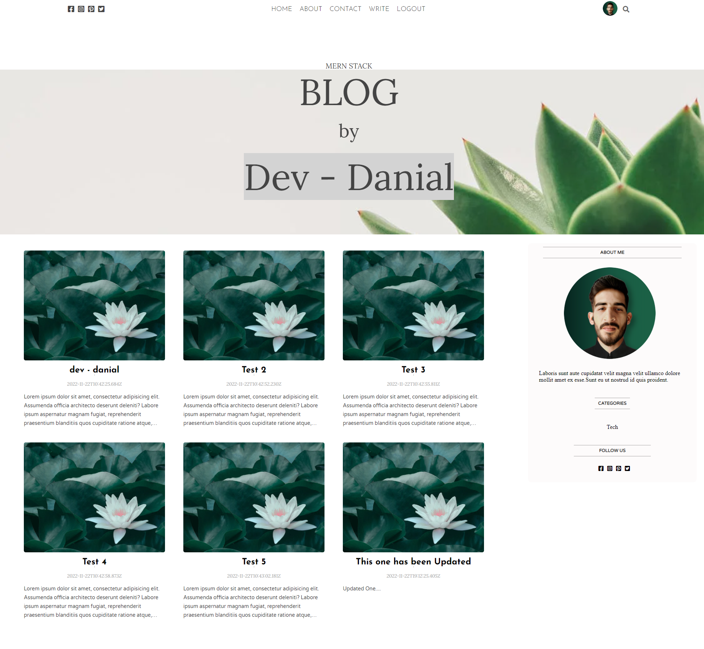
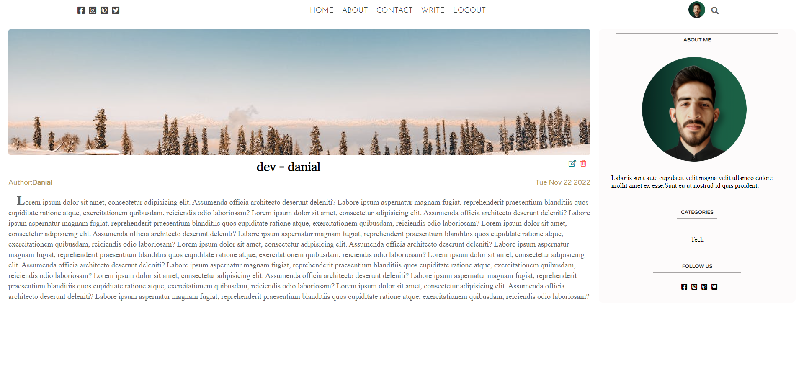
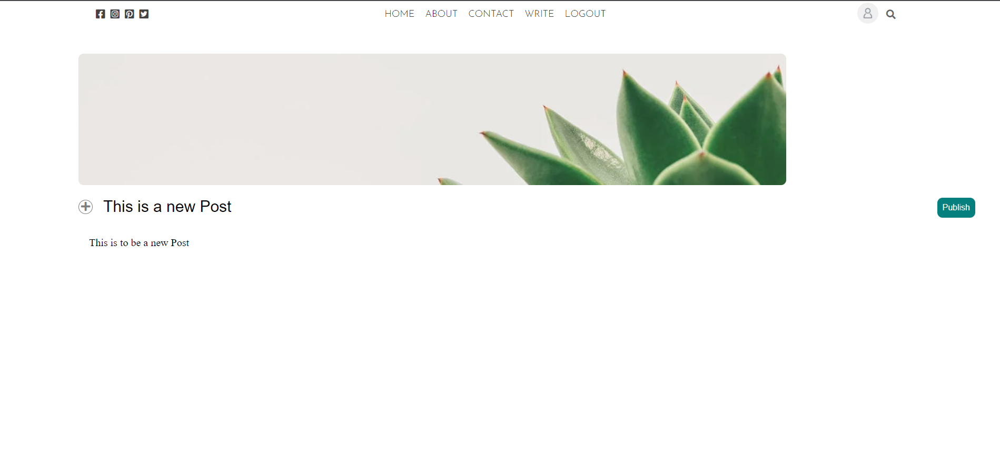
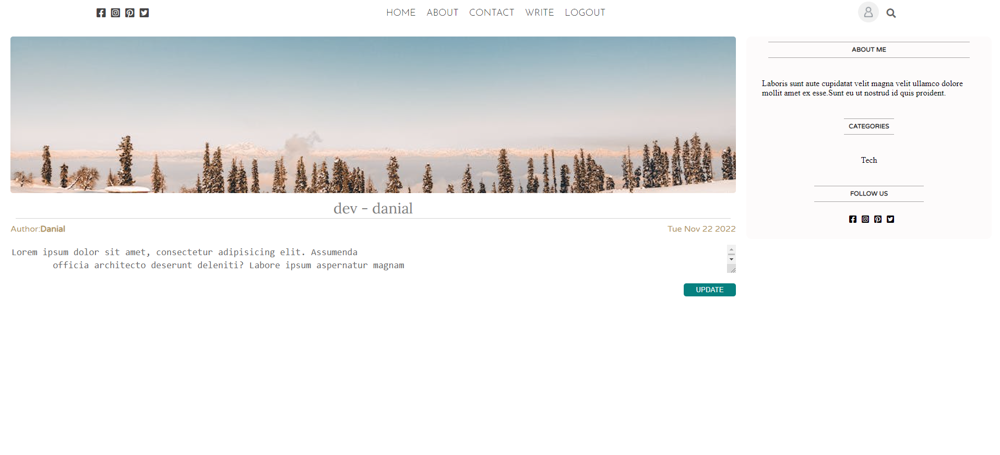
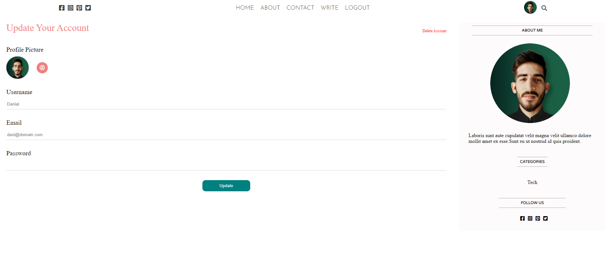
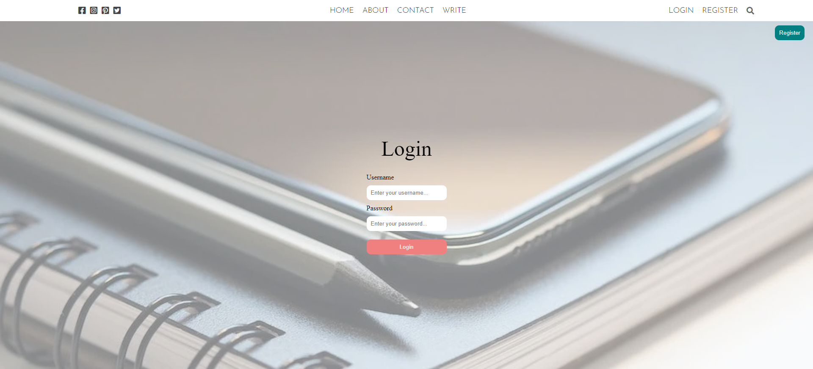
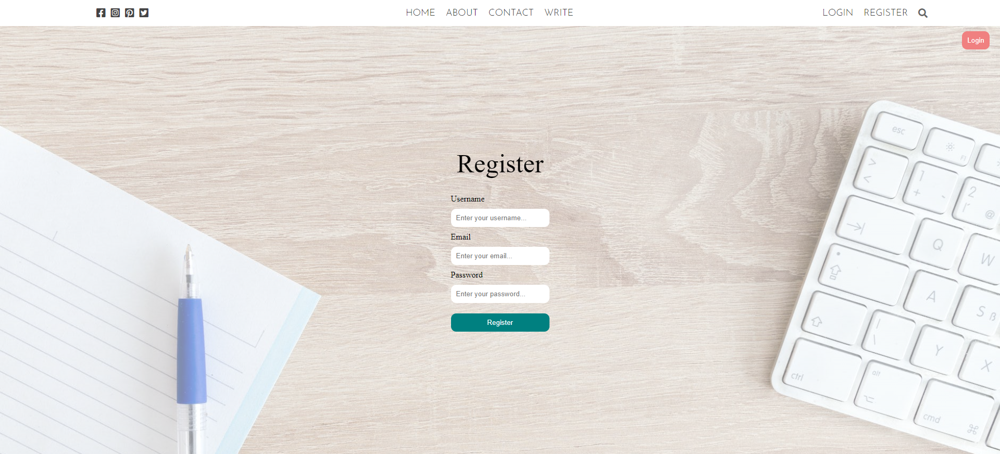

## MERN STACK BLOG

Blog site where user can **read** all posts, **register/login** and **create**, **edit** & **update** posts and his **profile**.

### Backend Dependencies

- express, nodemon, mongoose, dotenv, cors, path, body-parser, bcrypt, multer.

### Front-End Dependencies

- react, react-dom, react-router-dom, axios

## Preview

---
### Home

---
### Single Post

---
### Create Post

---
### Edit Post

---
### User Profile

---
### Login

---
### Register

---
